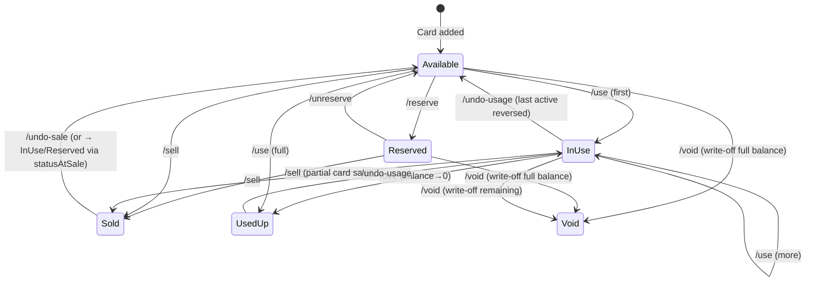

# Gift Card Management Web App (v4.0)

## Problem & Solution

Buy gift cards (merchant + prepaid Visa/MC/Amex) from deal sites → manage inventory → sell to dealers/friends/groups or use personally. Replaces error-prone spreadsheet with strict state machine, audit trail, and encrypted storage.

**Stack**: Node.js + Express + SQLite (`better-sqlite3`) backend, Vite + React 18 + `@tanstack/react-query` frontend, Vanilla CSS dark theme.

**Supplementary spec**: See [constraints_and_security.md](file:///home/opc/.gemini/antigravity/brain/197a3cfe-9178-4e20-890c-c4bc5243464a/constraints_and_security.md) for CHECK constraints, indexes, FK behavior, security hardening, backup/import details, and full verification plan.

---

## Data Model

> [!NOTE]
> All monetary values: `INTEGER` cents. All dates: ISO 8601. Encrypted fields: `base64(IV):base64(AuthTag):base64(Ciphertext)`. scrypt: `N=2^17, r=8, p=1`. Card numbers normalized (strip non-digits) before encrypt/hash/search/redact.

### Users
| Field | Type | Description |
|-------|------|-------------|
| `id` | INTEGER PK AUTO | |
| `pinHash` | TEXT | bcrypt-hashed PIN |
| `encryptionSalt` | TEXT | Salt for scrypt KEK derivation. **Rotated on PIN change** |
| `encryptedDEK` | TEXT | DEK wrapped by KEK |
| `createdAt` | DATETIME | |

### Deals
| Field | Type | Description |
|-------|------|-------------|
| `id` | INTEGER PK AUTO | |
| `name` | TEXT NOT NULL | |
| `source` | TEXT | |
| `purchaseDate` | TEXT | |
| `notes` | TEXT | |
| `archivedAt` | DATETIME NULL | |
| `createdAt` | DATETIME | |
| `updatedAt` | DATETIME | |

> Deal cost = `SUM(cards.purchaseCostCents)`. No totalCostCents column.

### Cards
| Field | Type | Notes |
|-------|------|-------|
| `id` | INTEGER PK AUTO | |
| `dealId` | INTEGER FK → deals | ON DELETE SET NULL |
| `brand` | TEXT NOT NULL | |
| `cardType` | TEXT NOT NULL | `CHECK(cardType IN ('merchant','prepaid'))` |
| `faceValueCents` | INTEGER NOT NULL | `CHECK(faceValueCents >= 0)`. **Immutable via PUT** |
| `remainingBalanceCents` | INTEGER NOT NULL | `CHECK(remainingBalanceCents >= 0 AND remainingBalanceCents <= faceValueCents)`. **Immutable via PUT** |
| `purchaseCostCents` | INTEGER NOT NULL DEFAULT 0 | `CHECK(purchaseCostCents >= 0)` |
| `cardNumber` | TEXT | **Encrypted**. Normalized (digits only) before encrypt/hash |
| `cardNumberHash` | TEXT | HMAC-SHA256 blind index via `HKDF(DEK, "blind-index-hmac")`. Exact-match only |
| `pin` | TEXT | **Encrypted** |
| `expirationDate` | TEXT | Plaintext (needed for "Expiring Soon" queries). See security tradeoff in supplementary |
| `cvv` | TEXT | **Encrypted** |
| `cardholderName` | TEXT | |
| `billingZip` | TEXT | **Encrypted** (payment auth field for prepaid cards) |
| `status` | TEXT NOT NULL | `CHECK(status IN ('available','reserved','sold','in_use','used_up','void'))` |
| `format` | TEXT | `CHECK(format IS NULL OR format IN ('digital','physical'))` |
| `source` | TEXT | **Snapshot** from deal at creation. Does not auto-update if deal.source changes |
| `notes` | TEXT | |
| `createdAt` | DATETIME | |
| `updatedAt` | DATETIME | |

### Transactions
| Field | Type | Notes |
|-------|------|-------|
| `id` | INTEGER PK AUTO | |
| `cardId` | INTEGER FK → cards | ON DELETE RESTRICT |
| `type` | TEXT NOT NULL | `CHECK(type IN ('sale','sale_reversal'))` |
| `buyerName` | TEXT | |
| `buyerType` | TEXT | `CHECK(buyerType IS NULL OR buyerType IN ('dealer','group_chat','friend','self'))` |
| `salePriceCents` | INTEGER | `CHECK(salePriceCents IS NULL OR salePriceCents >= 0)` |
| `remainingBalanceAtSaleCents` | INTEGER | Balance snapshot at time of sale |
| `statusAtSale` | TEXT | Status snapshot (`available`, `reserved`, or `in_use`) for accurate undo |
| `platform` | TEXT | |
| `reason` | TEXT | Required for reversals |
| `transactionDate` | TEXT | |
| `notes` | TEXT | |
| `createdAt` | DATETIME | |

### Usages
| Field | Type | Notes |
|-------|------|-------|
| `id` | INTEGER PK AUTO | |
| `cardId` | INTEGER FK → cards | ON DELETE RESTRICT |
| `amountCents` | INTEGER NOT NULL | `CHECK(amountCents > 0)` |
| `merchant` | TEXT | "Write-off (Voided)" for void write-offs |
| `description` | TEXT | |
| `isReversed` | INTEGER DEFAULT 0 | |
| `isWriteOff` | INTEGER DEFAULT 0 | Cannot be undone |
| `usageDate` | TEXT | |
| `createdAt` | DATETIME | |

> **Invariant**: For voided/used_up cards: `faceValueCents = SUM(amountCents WHERE isReversed=0)`. Void **always** creates a write-off usage for `remainingBalanceCents` (including from available/reserved), ensuring this invariant holds universally.

### Audit Log
| Field | Type | Notes |
|-------|------|-------|
| `id` | INTEGER PK AUTO | |
| `userId` | INTEGER | For future multi-user. Always 1 for now |
| `entityType` | TEXT NOT NULL | |
| `entityId` | INTEGER NOT NULL | |
| `action` | TEXT NOT NULL | |
| `oldValue` | TEXT | **Plaintext JSON, sensitive fields redacted** (`"••••4321"`, `"***"`) |
| `newValue` | TEXT | Same |
| `timestamp` | DATETIME | |

---

## Encryption Design

- **Envelope**: random DEK → wrapped by KEK → `scrypt(PIN, salt, N=2^17, r=8, p=1)`
- **HMAC key**: `HKDF(DEK, "blind-index-hmac")` — in memory alongside DEK
- **Card number normalization**: `input.replace(/\D/g, '')` before encrypt, hash, search, redact
- **Encrypted fields**: `cardNumber`, `pin`, `cvv`, `billingZip`
- **Plaintext tradeoff**: `expirationDate` kept plaintext for "Expiring Soon" dashboard queries. Without card number (encrypted), expiration alone is not actionable
- **PIN change**: new salt, new KEK, DEK re-wrapped. Card data untouched
- **Server restart**: DEK lost → 401 `dekLoaded: false` → re-login
- **Single-process only**

> [!IMPORTANT]
> **Transaction pattern**: Encrypt/HMAC **outside** transaction. Then `BEGIN IMMEDIATE` → read state → validate → write → commit. `BEGIN IMMEDIATE` acquires write lock upfront, preventing races even if better-sqlite3's synchronous nature already serializes. Belt-and-suspenders. No async inside transaction block.

---

## State Machine



**Key decisions:**
- **`in_use → sold`**: Allowed. Selling partially-used prepaid cards is realistic. Snapshots `remainingBalanceAtSaleCents` + `statusAtSale`
- **Void always writes off**: Every void creates a write-off usage for `remainingBalanceCents`, even from `available`/`reserved`. Ensures `faceValue = Σ(active usages)` universally
- **undo-sale restores `statusAtSale`**: Not always `available` — could be `in_use` or `reserved`
- **undo-usage is flexible**: Any non-reversed, non-writeoff usage can be reversed (not just the latest). Balance recalculated, status adjusted

---

## API Endpoints

### Auth
| Method | Path | Notes |
|--------|------|-------|
| GET | `/api/auth/status` | `{ setupComplete, sessionValid, dekLoaded }` |
| POST | `/api/auth/setup` | **409 if exists** |
| POST | `/api/auth/login` | Rate limited (3→30s, 5→5min, 10→30min). `req.session.regenerate()` |
| POST | `/api/auth/logout` | Clears DEK + session |
| POST | `/api/auth/change-pin` | Old PIN required. New salt. DEK re-wrapped |

### Cards — CRUD
| Method | Path | Notes |
|--------|------|-------|
| GET | `/api/cards` | Paginated. **Exact full card number** search via blind index. **sortBy whitelisted** |
| GET | `/api/cards/:id` | + transactions + usages + audit. `?includeReversed=true` for history |
| POST | `/api/cards` | Batch via `{ cards: [...] }`. Normalizes card numbers. Shared `cardHelpers.js` |
| PUT | `/api/cards/:id` | **Blocks**: balance, faceValue, status. **Terminal states** (sold/used_up/void): **notes only**. If cardNumber changed: re-encrypt + recompute hash |
| DELETE | `/api/cards/:id` | Only if `available`/`void` **AND no transactions AND no usages** |

### Cards — Actions (all use `BEGIN IMMEDIATE`)
| Path | From → To | Side Effects |
|------|-----------|--------------|
| `.../reserve` | available → reserved | Audit |
| `.../unreserve` | reserved → available | Audit |
| `.../sell` | available/reserved/**in_use** → sold | `sale` transaction (snapshots `remainingBalanceAtSaleCents` + `statusAtSale`). Sets `remainingBalanceCents = 0` |
| `.../use` | available/in_use → in_use/used_up | Usage record. `CHECK(amountCents <= remainingBalanceCents)`. Auto `used_up` at 0 |
| `.../void` | available/reserved/in_use → void | **Always** creates write-off usage for `remainingBalanceCents` (`isWriteOff=1`). Sets balance to 0 |
| `.../undo-sale` | sold → **statusAtSale** | `sale_reversal` transaction. Restores `remainingBalanceAtSaleCents`. `reason` required |
| `.../undo-usage` | in_use/used_up → in_use/available | Any `usageId` (flexible, not stack-based). **Rejects write-offs (409)**. `reason` required (stored in audit only). Recalculates status from remaining balance |

### Deals
| Method | Path | Notes |
|--------|------|-------|
| GET | `/api/deals` | P&L via `SUM(purchaseCostCents)`. Excludes archived unless `?includeArchived=true` |
| POST | `/api/deals` | Transient `totalCostCents` for allocation. Validates: sum(explicit) ≤ total. Remainder → last card |
| PUT | `/api/deals/:id` | name/source/date/notes |
| POST | `.../archive` / `.../unarchive` | |

### Read-Only
`GET /api/{transactions,usages,audit}` — paginated, filterable

### Lookup
`GET /api/lookup/{brands,sources,buyers,platforms}?q=` — direct `SELECT DISTINCT`, no cache

### CSV Import (stateless, re-validated)
`POST /api/cards/import-csv` → preview. `POST .../confirm` → re-validates via `cardHelpers.js`

### Backup
| Path | Notes |
|------|-------|
| `GET /api/backup/export` | **Plaintext** JSON. **Requires PIN re-entry** (or auth within 5 min). Includes `schemaVersion`, `exportedAt`, `appVersion`. UI: type "EXPORT" to confirm. Filename: `gc-backup-YYYY-MM-DD.json` |
| `GET /api/backup/db-file` | Raw `.db` (encrypted canonical) |
| `POST /api/backup/import` | Excludes `users`. Re-encrypts sensitive fields + computes hashes via current DEK. Resets `sqlite_sequence`. `replace`: drop+restore exact IDs. `merge`: cards-only (transactions/usages/audit ignored), new IDs, dedup by normalized cardNumberHash+brand (skip if null), **409 on conflicts** |

---

## Project Structure

```
/home/opc/dev/gc-management/
├── server/
│   ├── index.js              # Express entry. Single-process. BEGIN IMMEDIATE config
│   ├── db.js                 # Schema + WAL + CHECKs + indexes + FKs
│   ├── auth.js               # Session + DEK check + rate limiting + CSRF (sameSite:strict)
│   ├── encryption.js         # DEK/KEK, AES-256-GCM, HMAC, HKDF, scrypt, normalize
│   ├── cardHelpers.js        # Shared creation, validation, audit redaction, normalization
│   ├── routes/
│   │   ├── auth.js           # setup(409), login(regenerate), logout, change-pin(salt rotate)
│   │   ├── cards.js          # CRUD + 7 action endpoints (BEGIN IMMEDIATE)
│   │   ├── deals.js          # CRUD + archive + transient allocation
│   │   ├── transactions.js / usages.js / audit.js / lookup.js
│   │   └── backup.js         # JSON(plaintext+PIN re-entry), .db, import(re-encrypt)
│   └── gcmanager.db
├── src/
│   ├── main.jsx / App.jsx / index.css
│   ├── api/client.js
│   ├── contexts/AuthContext.jsx
│   ├── hooks/{useCards,useDeals,useTransactions,useUsages,useLookup}.js
│   ├── pages/{Login,Setup,Dashboard,Cards,CardDetail,Deals,DealDetail,Transactions,Audit}Page.jsx
│   ├── components/
│   │   ├── layout/{Sidebar,AppShell}.jsx
│   │   ├── cards/{CardTable,CardForm,CardStatusBadge,SellCardModal,UseCardModal,UndoUsageModal,BatchCardForm}.jsx
│   │   ├── deals/{DealTable,DealForm}.jsx
│   │   ├── {transactions/TransactionTable,usages/UsageTable}.jsx
│   │   └── common/{Modal,Toast,ComboBox,SearchBar,DataTable,ConfirmDialog,StatusBadge,ImportModal}.jsx
│   └── utils/{csvImport,csvExport,formatters}.js
├── package.json / vite.config.js / .gitignore
```
